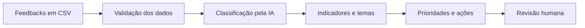
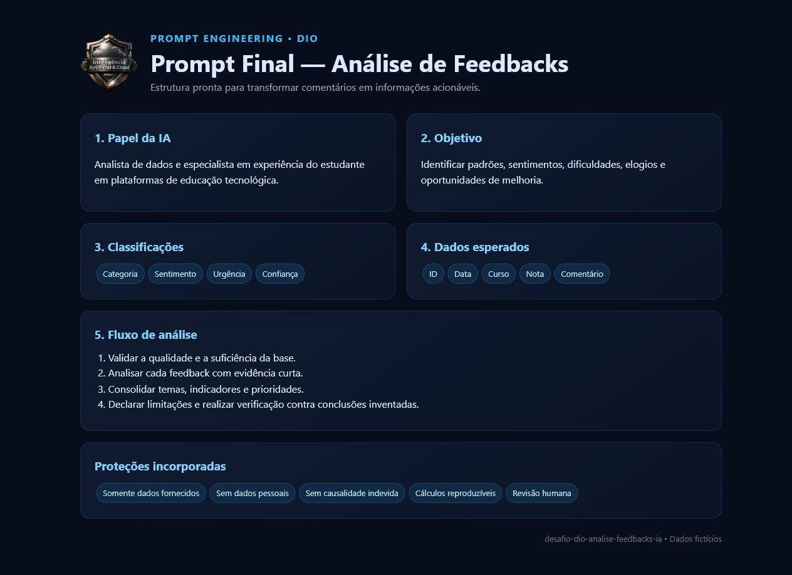
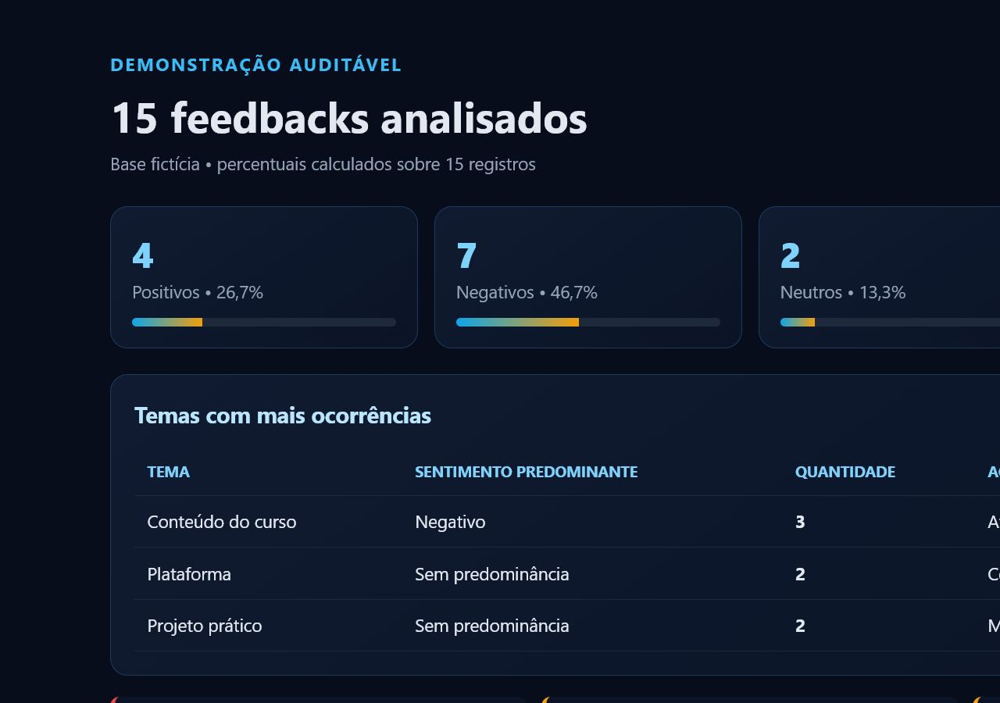

<div align="center">
  

  # Análise de Feedbacks com Inteligência Artificial

  **Da voz do estudante a decisões claras, responsáveis e acionáveis**

  
</div>


Projeto de portfólio desenvolvido para o desafio **“Passo 3: Una as peças e refine”**, da Digital Innovation One (DIO). A entrega apresenta um prompt reutilizável para transformar feedbacks não estruturados de estudantes em informações úteis e acionáveis.

> **Aviso:** todos os dados deste repositório são fictícios e foram criados apenas para fins educacionais.

## Objetivo

Criar um prompt claro, completo e seguro para orientar uma ferramenta de inteligência artificial na análise de comentários sobre cursos e bootcamps. A análise apoia melhorias em:

- qualidade e organização dos conteúdos;
- didática dos instrutores;
- projetos práticos;
- plataforma e certificados;
- suporte, comunidade e acessibilidade;
- experiência geral dos estudantes.

## Visão geral

O projeto combina uma base fictícia controlada, um prompt com regras contra alucinações e uma resposta demonstrativa com cálculos auditáveis.



### Prompt estruturado



### Análise demonstrativa



## Problema analisado

Feedbacks escritos livremente são valiosos, mas difíceis de comparar em escala. O projeto propõe uma estrutura que classifica tema, sentimento, urgência e confiança, identifica evidências e converte os achados em recomendações sem inventar informações.

## Estrutura do repositório

```text
desafio-dio-analise-feedbacks-ia/
├── README.md
├── prompt_final.md
├── dados/
│   └── feedbacks_exemplo.csv
├── exemplos/
│   └── exemplo_de_resposta.md
├── assets/
│   ├── capa-analise-feedbacks.png
│   ├── logo-ia-cloud.webp
│   └── capturas/
│       ├── analise-exemplo.png
│       ├── github-vitrine.png
│       └── prompt-final.png
└── LICENSE
```

| Arquivo | Finalidade |
|---|---|
| [`prompt_final.md`](prompt_final.md) | Prompt principal pronto para uso |
| [`dados/feedbacks_exemplo.csv`](dados/feedbacks_exemplo.csv) | Base educacional com 15 registros fictícios |
| [`exemplos/exemplo_de_resposta.md`](exemplos/exemplo_de_resposta.md) | Demonstração com cálculos conferidos |
| [`assets/`](assets/) | Logo, capa e capturas usadas na apresentação |
| [`LICENSE`](LICENSE) | Licença MIT |

## Engenharia de prompts

Engenharia de prompts é a prática de organizar instruções, contexto, dados, critérios e formato de saída para tornar a resposta de uma IA mais consistente e verificável. Um bom prompt não garante que toda resposta esteja correta; por isso, este projeto também exige evidências, explicitação de limitações e revisão humana.

### Componentes utilizados

| Componente | Aplicação no projeto |
|---|---|
| Papel | Define a IA como analista de dados e especialista em experiência do estudante |
| Objetivo | Converte feedbacks em padrões, indicadores e ações |
| Contexto | Explica quem usará a análise e quais temas podem aparecer |
| Dados | Documenta os campos esperados e possíveis problemas de qualidade |
| Instruções | Estabelece validação, análise individual e consolidação |
| Formato | Padroniza resumo, tabelas, prioridades e limitações |
| Restrições | Impede invenções, exposição de dados pessoais e causalidade indevida |

## Como utilizar

1. Abra o arquivo [`prompt_final.md`](prompt_final.md).
2. Copie todo o prompt.
3. Cole o conteúdo em uma ferramenta de IA.
4. Anexe o CSV ou cole os dados que serão analisados após o prompt.
5. Revise os resultados e as evidências antes de tomar decisões.

O prompt pode ser usado sem alterações obrigatórias. Para testar, utilize a base fictícia disponível em [`dados/feedbacks_exemplo.csv`](dados/feedbacks_exemplo.csv).

## Exemplo de entrada

```csv
id_feedback,data,curso,modulo,canal,nota,comentario,status,categoria_informada
FB001,2026-06-02,Formação Java,Orientação a Objetos,Pesquisa de satisfação,5,"A instrutora explicou os conceitos com clareza e usou exemplos que facilitaram muito o aprendizado.",analisado,didática do instrutor
```

## Exemplo resumido de saída

```markdown
### Resumo executivo

Foi analisado 1 feedback positivo sobre didática do instrutor.
A evidência indica que clareza e exemplos facilitaram o aprendizado.

### Ação sugerida

Documentar e compartilhar as práticas didáticas utilizadas nesse módulo.
```

A demonstração completa, baseada nos 15 registros, está em [`exemplos/exemplo_de_resposta.md`](exemplos/exemplo_de_resposta.md).

## Privacidade e prevenção de alucinações

- Não use nomes, e-mails, telefones, documentos ou outros dados pessoais.
- Anonimize informações sensíveis antes do envio a qualquer ferramenta.
- Exija evidências curtas e vinculadas ao identificador do feedback.
- Confira totais, percentuais e denominadores.
- Não aceite causas, estimativas ou recomendações sem apoio nos dados.
- Diferencie observações, interpretações e recomendações.
- Mantenha revisão humana antes de qualquer decisão.

## Limitações

- A qualidade da análise depende da qualidade e da representatividade da base.
- Linguagem ambígua, ironia e comentários muito curtos podem reduzir a confiança.
- Uma amostra pequena não permite generalizações sobre toda a comunidade.
- A classificação de sentimento e urgência ainda requer validação humana.
- O prompt não substitui investigação técnica nem pesquisa estatística.

## Aprendizados

O desafio demonstra como contexto, critérios objetivos, formato fixo e restrições tornam um prompt mais verificável. Também reforça que uma análise responsável deve declarar dados ausentes, evitar causalidade indevida e preservar a privacidade.

## Possibilidades de evolução

- validar o prompt com bases maiores e anonimizadas;
- criar um glossário de classificação com exemplos;
- comparar classificações humanas e respostas da IA;
- adicionar métricas de concordância e controle de qualidade;
- adaptar categorias a diferentes produtos educacionais.

## Como clonar

```bash
git clone https://github.com/YanCarneosso/desafio-dio-analise-feedbacks-ia.git
cd desafio-dio-analise-feedbacks-ia
```

## Entrega do desafio

O arquivo principal solicitado pela DIO é:

```text
prompt_final.md
```

Depois de publicar o projeto, abra esse arquivo no GitHub e copie a URL da página. Esse link pode ser utilizado no campo de submissão da plataforma.

## Licença

Distribuído sob a licença MIT. Consulte [`LICENSE`](LICENSE).
